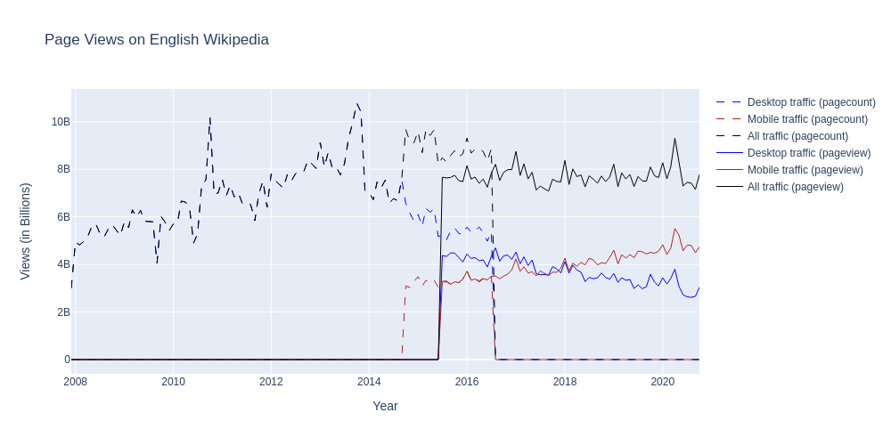

# Title of your post
> **Date:** 07.11.2020 - 15:37 PM *(Due: 17.11.2020 - 03:00 PM)*  
> **Name:** `mane` Marisa N.  
> **Session:** [02 Exercise](https://github.com/FUB-HCC/hcds-winter-2020/wiki/02_exercise)   
----

## R2 - Reflection
> Book: The Practice of Reproducible Research (Chapter 2 and 3)

### Definitions
_Reproducibility and replicability_

The book uses definitions described by Goodman, Fanelli, & Ioannidis (2016), that have their origin in epidemiology, computational biology, economics, and clinical trials. For reproducibility it is:

> the ability of a researcher to duplicate the results of a prior study using the same materials as were used by the original investigator. That is, a second researcher might use the same raw data to build the same analysis files and implement the same statistical analysis in an attempt to yield the same results.

and for replicability:

> which refers to the ability of a researcher to duplicate the results of a prior study if the same procedures are followed but new data are collected.

_How does this relate to the definitions given in the lecture?_

In the lecture definitions from Kitzes, J., Turek, D., & Deniz, F. (Eds.). (2018) are used. For reproducibility it is:

> A research project is computationally reproducible if a second investigator (including you in the future) can recreate the final reported results of the project, including key quantitative findings, tables, and figures, given only a set of files and written instructions.

and for replicability:

> \[It\] involves applying the same methods to new data and achieving a commensurate, confirming, or contradictory result.

For both entities - book and lecture - the definitions for reproducibility do not differ very much. One difference, however, lies in the specification of the resources to be made available to achive reproducibility. In the lecture, they suggest that _files and written instructions_ should be provided, whereas in the book, they only speak about the raw data that should be provided. Thus following  the first definition, it might me needed to implemet the statistical analysis that where used again. 

Also in the description of reproducibility the two definitions are very similar. However, the first definition only speaks about duplicating the results, whereas the second also aims to create commensurate, confirming, or contradictory results.

### 🗨️&nbsp; "How does the reading inform your understanding of human centered data science?"  
_Describe in at least 2-3 full sentences._

It infroms me which question I could ask myself when I conduct a (data) science project to achive a better reproducibility. It introduce a practical reproducibility workflow, that consits for three phases: data aquisition, data processing and data analysis. For each phase it is described basic routines that can be followed.

### ❓&nbsp; Questions
_List at least 1 question (full sentence) that this reading raised in your mind, and say why._

1. What can be done to make sure that the data source (if it is coming from a different party) is sustainably available? Or is this not so important if we include the raw extrated data from that source into oure project? Because as in oure coding assignment it can happen that an API changes or disappears and even if we document and link to that API it might not me helpful in the future if the data source is not available anymore.

***

## A2 - Reproducibility Workflow
_Briefly describe your experience using the reproducibility workflow._

The workflow helped me to just focus on one step at a time and not to already anticipate future actions. This is good for many reasons but most important with this approach it is assured that the needed artifacts are created at the end of each phase.

### Final Wikipedia Page View Plot
_Add an image of your plot here and describe what you can see._ 🖼️ 

For the Pagecounts API we see that untill around October 2014 there seems to be no mobile traffic, thus the desktop traffic is exaclty equivalent to the overall traffic and therefor the blue line is not clearly visible. We can also see, that between July 2015 and July 2016 there is available data bith APIs (Pagecounts and Pageview), probably due too the fact the Pageview API  excludes spiders/crawlers from the data.

The overall traffic on Wikipeda is slowly growing at the beginning (from December 2007 untill around April 2015) and then reaches a more stable plateau with smaler flactuations. From October 2014 the mobile traffic is slowly but constantly growing while the desktop traffic is decreasing since then. Around November 2017 the mobile traffic exceeds the desktop traffic.

### Challenges
_Describe what tasks were challenging to you._
_What was surprising, what did you learn?_ 😮 

The whole documentation process took much longer than expected (even longer than the coding). To bring everything together ( general documentaion, licenses, code documentation, etc.) is definitly not a trevial task. I have learned a lot in this area and will probably appreciate well documented repositories even more in the future.